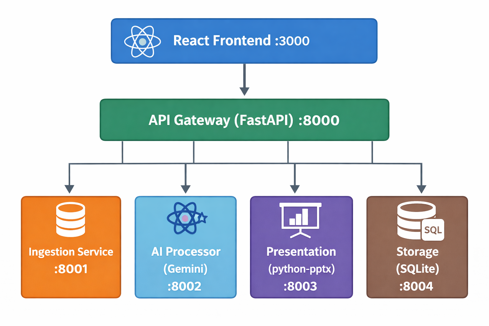
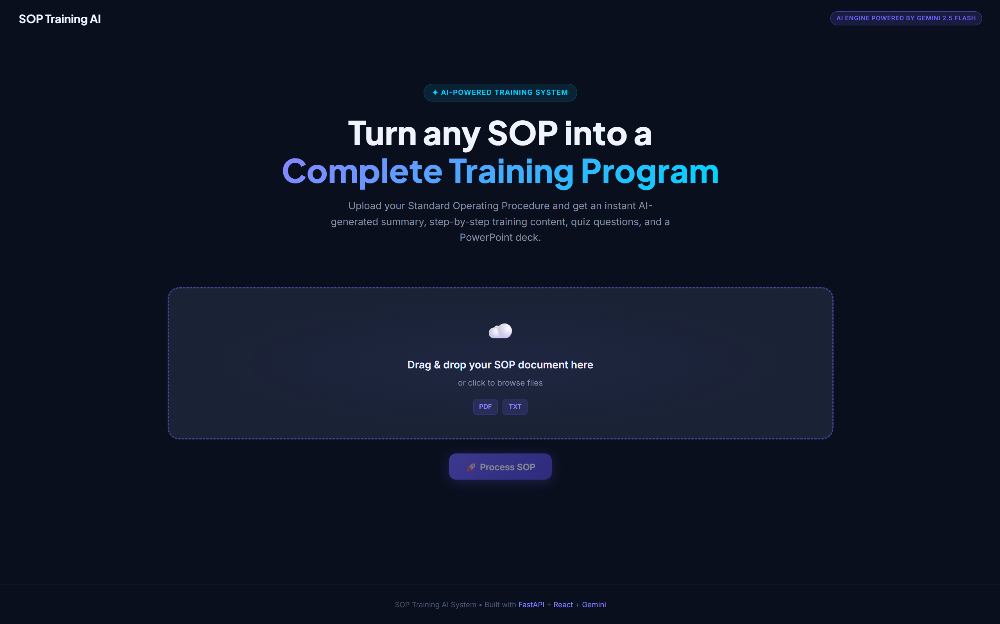
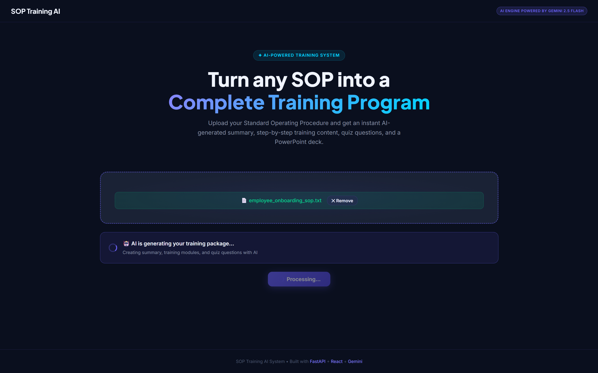
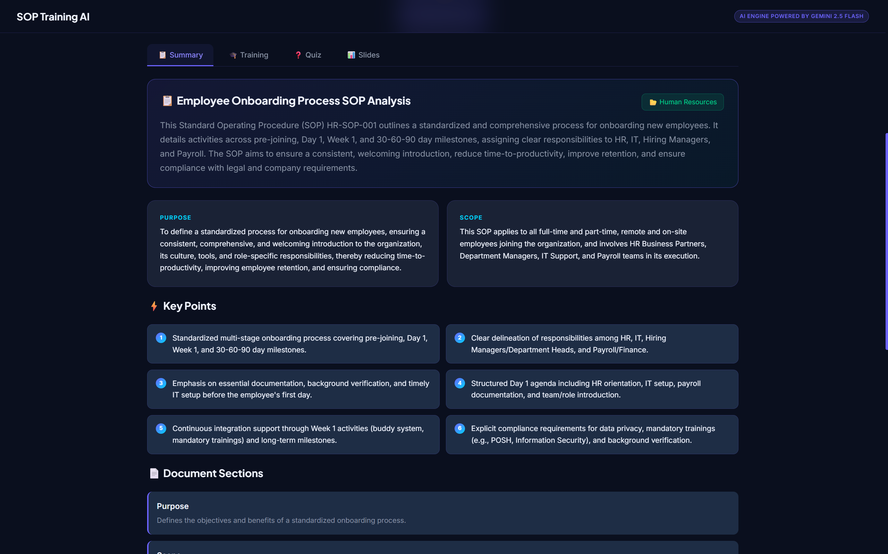
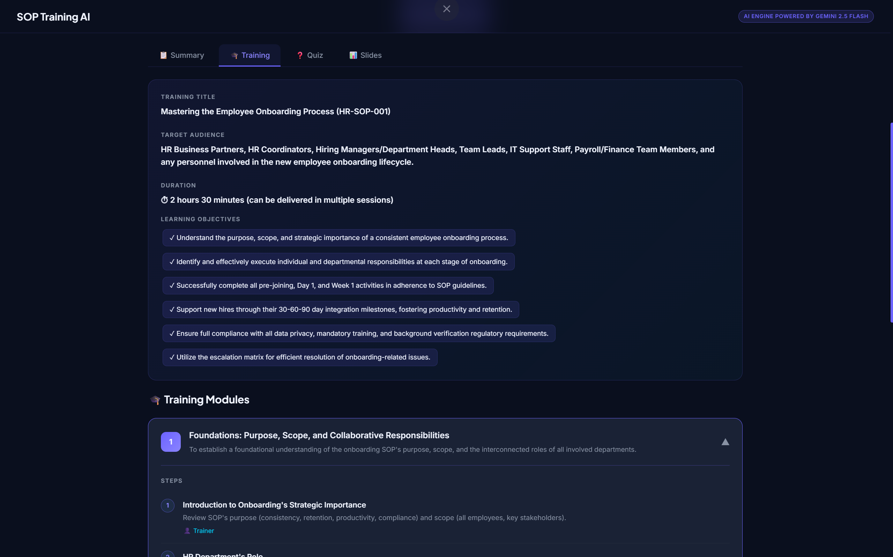
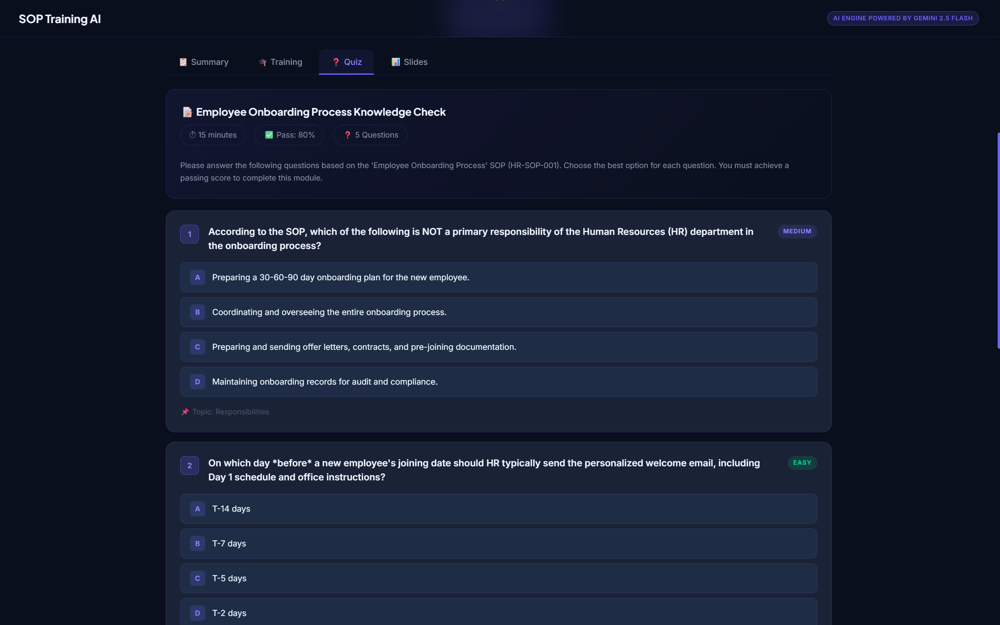
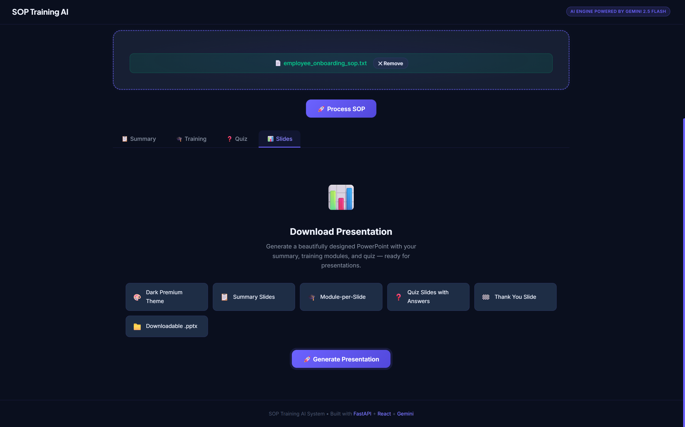

<div align="center">
  
# 🧠 SOP → AI Training System


> **AI-Powered SOP to Training Package Converter**  

</div>

**SOP Training System** is a full-stack, AI-powered application designed to automate employee onboarding and training. By simply uploading any Standard Operating Procedure (SOP) document (PDF or TXT), the system leverages Google's Gemini AI to instantly generate a comprehensive summary, step-by-step training modules, interactive quiz questions, and a downloadable PowerPoint (.pptx) presentation. Built with a scalable microservices architecture, it seamlessly orchestrates document processing, AI generation, and secure storage to streamline organizational training.

---

## 🏗️ Architecture



### Services

| Service | Port | Responsibility |
|---|---|---|
| `gateway` | 8000 | Routes requests to all downstream services |
| `ingestion` | 8001 | PDF/text upload and text extraction |
| `ai-processor` | 8002 | Gemini AI — summary, training, quiz |
| `presentation` | 8003 | Generates downloadable `.pptx` |
| `storage` | 8004 | SQLite persistence of all jobs |
| `frontend` | 3000 | React demo UI |

---

## 🚀 Quick Start

### 1. Prerequisites
- [Docker Desktop](https://www.docker.com/products/docker-desktop/)
- A [Google Gemini API Key](https://aistudio.google.com/app/apikey) (free tier available)

### 2. Configure Environment

```bash
cd y:\Folder_name\sop-training-system
copy .env.example .env
# Edit .env and add your GEMINI_API_KEY
```

### 3. Build and Run

```bash
docker-compose up --build
```

Wait ~60 seconds for all services to start, then open:

- **Frontend UI**: http://localhost:3000
- **Gateway API**: http://localhost:8000/docs
- **Health Check**: http://localhost:8000/api/health

### Output Preview







*(Note: A sample generated PowerPoint (.pptx) file is also attached to this repository so you can see the final output!)*

### 4. Test the System

1. Open http://localhost:3000
2. Drag and drop `sample_data/employee_onboarding_sop.txt`
3. Click **Process SOP**
4. Explore the **Summary**, **Training**, **Quiz**, and **Slides** tabs
5. Click **Generate Presentation** → **Download .pptx**

---

## 🔧 Running Without Docker (Development)

### Backend Services

```bash
# Ingestion Service
cd services/ingestion
pip install -r requirements.txt
uvicorn main:app --port 8001 --reload

# AI Processor (needs GEMINI_API_KEY in env)
cd services/ai_processor
pip install -r requirements.txt
set GEMINI_API_KEY=your_key_here
uvicorn main:app --port 8002 --reload

# Presentation Service
cd services/presentation
pip install -r requirements.txt
uvicorn main:app --port 8003 --reload

# Storage Service
cd services/storage
pip install -r requirements.txt
uvicorn main:app --port 8004 --reload

# Gateway (update env vars to localhost URLs)
cd services/gateway
pip install -r requirements.txt
set INGESTION_URL=http://localhost:8001
set AI_PROCESSOR_URL=http://localhost:8002
set PRESENTATION_URL=http://localhost:8003
set STORAGE_URL=http://localhost:8004
uvicorn main:app --port 8000 --reload
```

### Frontend

```bash
cd frontend
npm install
npm run dev
# Opens at http://localhost:3000
```

---

## 📡 API Reference

### Gateway Endpoints

| Method | Endpoint | Description |
|---|---|---|
| `GET` | `/api/health` | Health check for all services |
| `POST` | `/api/upload` | Upload PDF/TXT → extract text |
| `POST` | `/api/process` | Run AI processing on extracted text |
| `POST` | `/api/presentation` | Generate `.pptx` presentation |
| `GET` | `/api/jobs` | List all processed jobs |
| `GET` | `/api/jobs/{id}` | Get specific job result |

Full Swagger docs available at: http://localhost:8000/docs

---

## 📂 Project Structure

```
sop-training-system/
├── docker-compose.yml
├── .env.example
├── sample_data/
│   └── employee_onboarding_sop.txt
├── services/
│   ├── ingestion/        # PDF/text parser
│   │   ├── main.py
│   │   ├── requirements.txt
│   │   └── Dockerfile
│   ├── ai_processor/     # Gemini AI integration
│   │   ├── main.py
│   │   ├── requirements.txt
│   │   └── Dockerfile
│   ├── presentation/     # PowerPoint generator
│   │   ├── main.py
│   │   ├── requirements.txt
│   │   └── Dockerfile
│   ├── storage/          # SQLite persistence
│   │   ├── main.py
│   │   ├── requirements.txt
│   │   └── Dockerfile
│   └── gateway/          # API Gateway
│       ├── main.py
│       ├── requirements.txt
│       └── Dockerfile
└── frontend/             # React + Vite UI
    ├── src/
    │   ├── App.jsx
    │   ├── main.jsx
    │   └── index.css
    ├── index.html
    ├── vite.config.js
    ├── package.json
    ├── nginx.conf
    └── Dockerfile
```

---

## Output Format

The AI Processor returns a structured JSON package with three sections:

```json
{
  "summary": {
    "title": "...",
    "overview": "...",
    "key_points": ["..."],
    "sections": [{ "heading": "...", "summary": "..." }]
  },
  "training": {
    "modules": [{
      "title": "...",
      "objective": "...",
      "steps": [{ "action": "...", "details": "..." }],
      "tips": ["..."]
    }]
  },
  "quiz": {
    "questions": [{
      "question": "...",
      "options": { "A": "...", "B": "...", "C": "...", "D": "..." },
      "correct_answer": "A",
      "explanation": "..."
    }]
  }
}
```

---

## 🛠️ Tech Stack

| Layer | Technology |
|---|---|
| Microservices | Python 3.11, FastAPI, Uvicorn |
| AI Engine | Google Gemini 1.5 Flash |
| PDF Parsing | pdfplumber |
| Slides | python-pptx |
| Database | SQLite + SQLAlchemy (async) |
| Frontend | React 18, Vite, Lucide Icons |
| Container | Docker, Docker Compose |
| Proxy | Nginx |

---

**Made by Yuvraj Singh**
